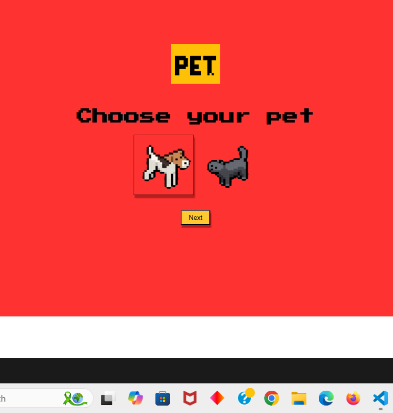
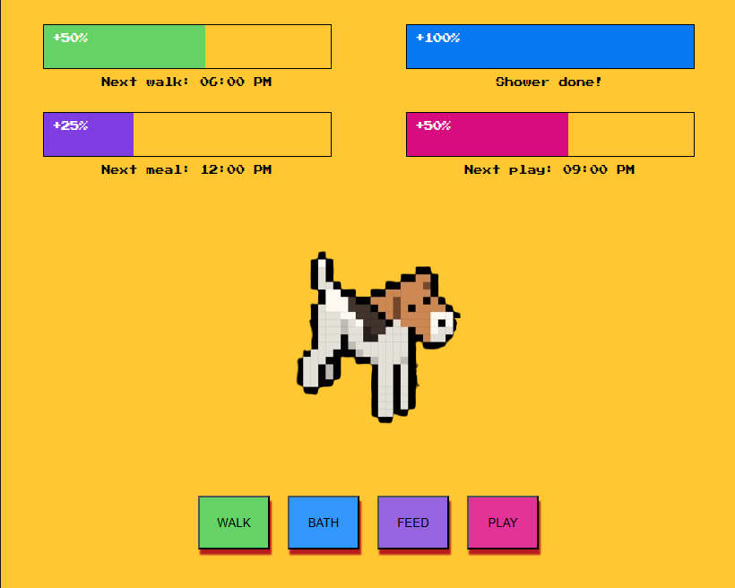
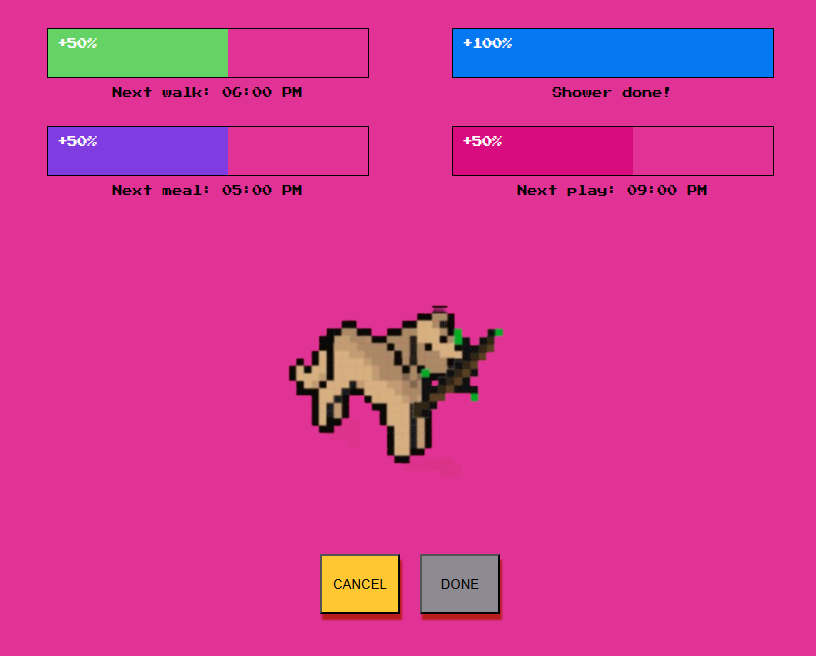
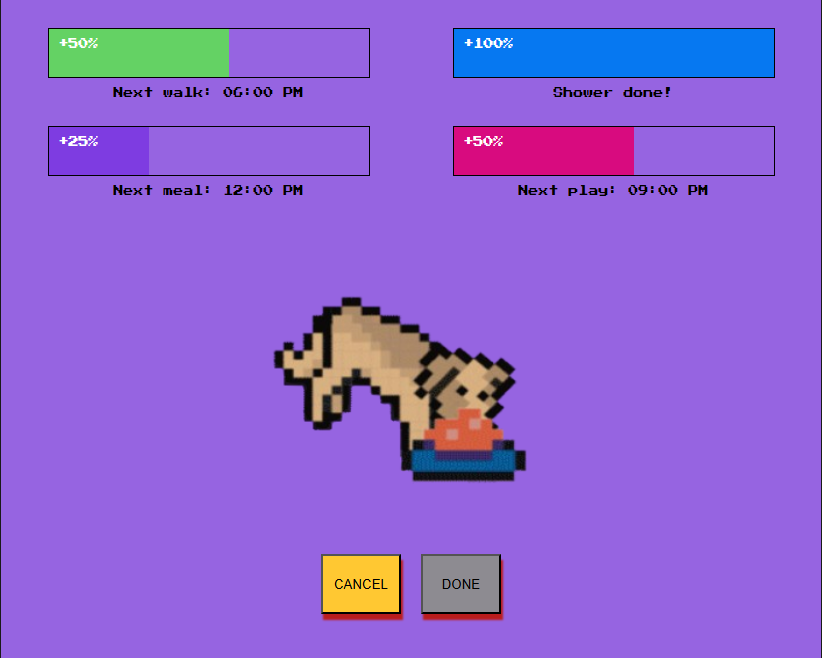
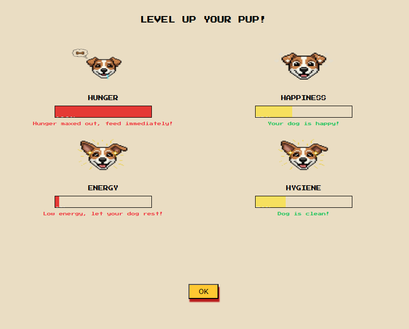

# 🐶 PetCare – Virtual Pet Management App

**PetCare** is a fun, interactive virtual pet management app built with **React** that allows users to take care of their digital pets by feeding, bathing, playing, and walking them.  
Each action affects the pet’s core attributes — **Hunger**, **Happiness**, **Energy**, and **Hygiene** — in real time.

---
## 🖼️ Screenshots

### Landing Page


### Pet Attributes


### Playing with Pet


### Feeding Pet


### Feeding Pet


## 🌟 Features

- 🕒 **Real-time Pet State Updates** – The app continuously checks your pet’s scheduled tasks (feed, bath, play, walk) and applies penalties if missed.
- 🍽️ **Feeding System** – Feed your pet to reduce hunger and keep them healthy.
- 🧼 **Bathing System** – Maintain hygiene by bathing your pet on time.
- 🎮 **Playtime** – Play with your pet to improve happiness and energy.
- 🚶 **Walk Tracker** – Walk your pet regularly to maintain good energy and mood.
- ⚙️ **Dynamic Attribute Bars** – Visual indicators show your pet’s current stats.
- 💾 **Persistent Data** – Pet info and schedules are stored in state/context (can later be extended with local storage or backend).

---

## 🧩 Tech Stack

| Technology | Purpose |
|-------------|----------|
| **React + Vite** | Frontend framework |
| **Context API** | Global state management for pet data |
| **JavaScript (ES6+)** | Logic and real-time updates |
| **CSS / Tailwind (optional)** | UI styling |
| **React Hooks** | State and effect handling |

---

## 🧠 How It Works

The pet’s main attributes are continuously monitored and updated through scheduled checks:

```js
// Example: Feed penalty check
Object.entries(prevPetInfo.additional.feed || {}).forEach(([key, time]) => {
  if (isTaskMissed(time) && feedProgressCounter < Number(key)) {
    hunger = Math.min(hunger + 1, 100); // pet gets hungrier
  }
});
