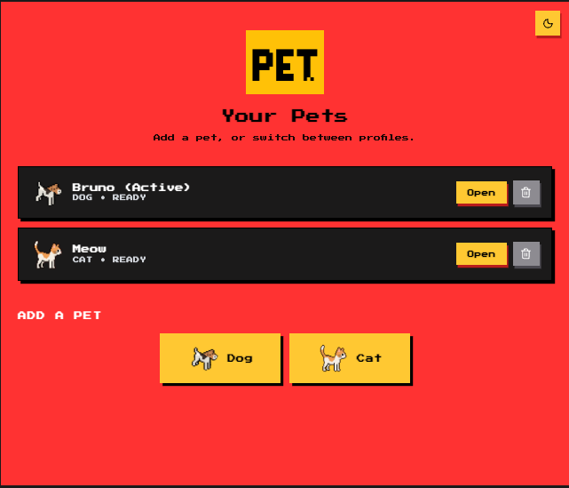
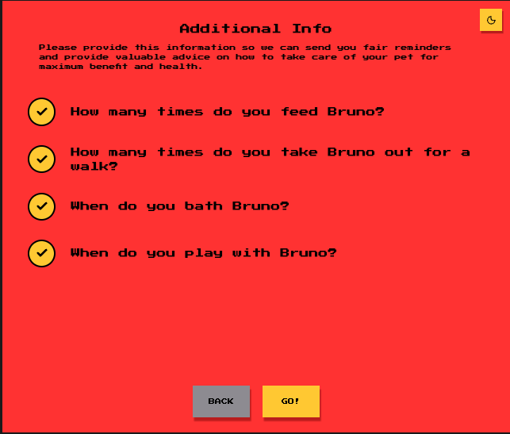
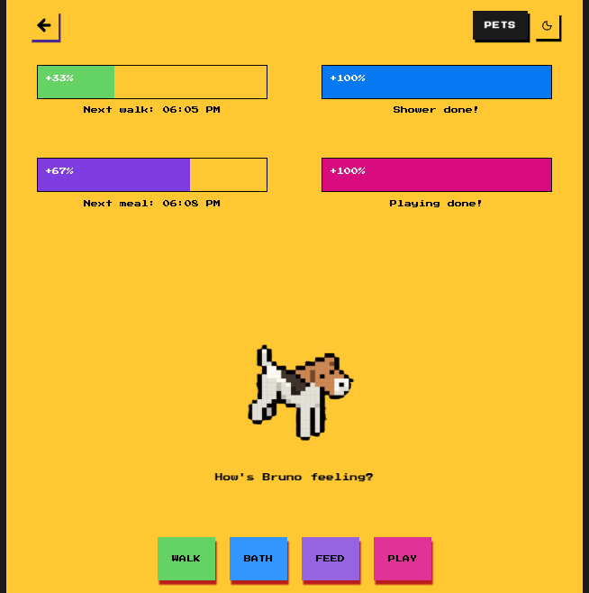
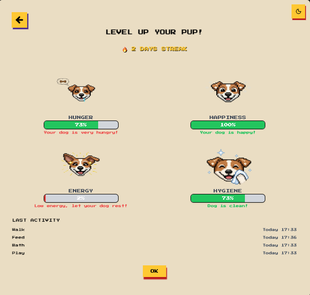

# 🐶 PetCare – Virtual Pet Management App

# 🐾 PetHQ

A modern **virtual pet care web app** built with **React** where users adopt pets, manage daily routines, and keep their pets happy through consistent care.

PetHQ combines **habit tracking + simulation gameplay** by turning daily pet care into an engaging experience.

---

## ✨ Live Demo

🔗 Add your deployed link here
`https://pethq.vercel.app/`

---

## 🖼️ Screenshots

### Landing Page


### Onboarding


### Pet Dashboard


### Pet Attributes


---

# 🚀 Features

## 🐶 Multi-Pet Management

* Create and manage multiple pets
* Supports cats and dogs
* Each pet has separate:

  * Profile
  * Schedules
  * Stats
  * Activity history
  * Streak progress

---

## 🧠 Smart Pet Simulation

Every pet has living attributes:

* 🍖 Hunger
* 😄 Happiness
* ⚡ Energy
* 🚿 Hygiene

Stats naturally change over time.

Even if the app is closed, PetHQ calculates elapsed time and updates stats realistically.

---

## 📅 Daily Care Scheduling

Users can schedule daily routines:

* Feed
* Walk
* Bath
* Play

---

## ⚠️ Missed Task Penalties

Missing tasks impacts your pet:

| Missed Task | Effect          |
| ----------- | --------------- |
| Feed        | Hunger worsens  |
| Walk        | Energy drops    |
| Play        | Happiness drops |
| Bath        | Hygiene drops   |

---

## 🎮 Interactive Care Actions

Complete activities to improve stats:

### Feed

* Hunger ↓
* Energy ↑
* Happiness ↑

### Play

* Happiness ↑
* Energy ↓

### Walk

* Happiness ↑
* Hunger ↑
* Energy ↓

### Bath

* Hygiene ↑

---

## 🔥 Streak & Habit System

Complete all daily tasks to build streaks.

Tracks:

* Consecutive perfect days
* Last completed actions
* Daily consistency

---

## 🔔 Reminder System

Supports:

* Browser notifications
* In-app toast alerts

---

## 🌙 Dark Mode

Toggle between Light / Dark mode.

---

# 🧱 Tech Stack

## Frontend

* React
* React Router
* Context API
* Custom Hooks
* Tailwind CSS
* Lucide React

## Storage

* LocalStorage
* Multi-profile persistence

---

# 🧠 What I Learned Building This Project

## ⚛️ React Architecture

* How to structure medium-sized React projects
* Reusable component design
* Prop-driven UI systems
* Component composition

---

## 🌍 State Management

* Managing complex global state using Context API
* Handling multi-entity data (multiple pets)
* Avoiding prop drilling
* Designing scalable state flows

---

## 🪝 Custom Hooks

Built reusable hooks for:

* Pet simulation
* Notifications
* Activity history
* Data syncing

Learned how to separate logic from UI.

---

## ⏱️ Time-Based Systems

One of the biggest learnings:

Instead of simple intervals, I learned to calculate:

```text id="rpbjlwm"
Last Update Time → Current Time → Apply Changes
```

Used for:

* Offline progress
* Realistic stat decay
* Better performance

---

## 💾 Persistence & Browser Storage

* Saving structured app data in localStorage
* Recovering corrupted storage safely
* Data migration for older versions
* Persisting themes and user progress

---

## 🧠 Product Thinking

Learned how to build features that improve engagement:

* Streak systems
* Reminder systems
* Emotional feedback loops
* Progress tracking
* Gamification mechanics

---

## 🎨 UI / UX

* Designing dashboard interfaces
* Visual feedback through animations
* Toast notifications
* Dark mode experience
* Habit-focused user flows

---

## 🐞 Debugging & Refactoring

* Breaking large logic into reusable modules
* Improving maintainability
* Refactoring repetitive code
* Handling edge cases in time/date logic

---

# 📂 Project Structure

```text id="i2jlwm"
src/
│── components/
│── pages/
│── hooks/
│── context/
│── lib/
│── assets/
```

---

# 📦 Installation

```bash id="woq4fs"
git clone https://github.com/yourusername/pethq.git](https://github.com/sushmitakanchan/pet-care-app.git
cd pethq
npm install
npm run dev
```

---

# 🚀 Future Improvements

* Authentication
* Cloud save sync
* Achievements
* Pet leveling
* Sound effects
* Mobile PWA version
* Backend support

---

# 💼 Why This Project Matters

This project helped me practice building something beyond CRUD apps by combining:

* Frontend engineering
* State management
* Simulation systems
* User engagement design
* Real product thinking

---

# 👨‍💻 Author

Sushmita Kanchan

GitHub: https://github.com/sushmitakanchan

---

# ⭐ If You Like This Project

Give it a star!


---
